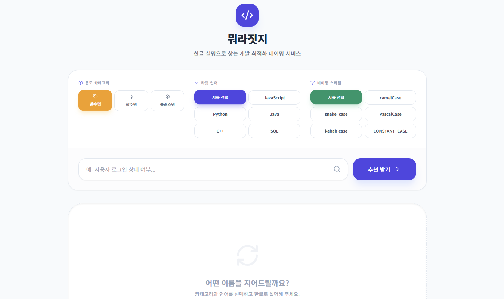
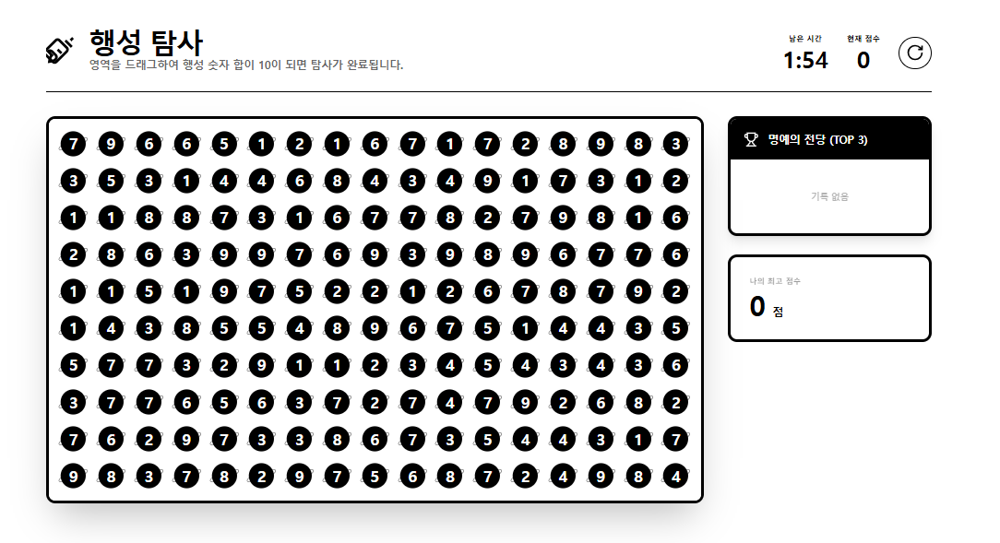
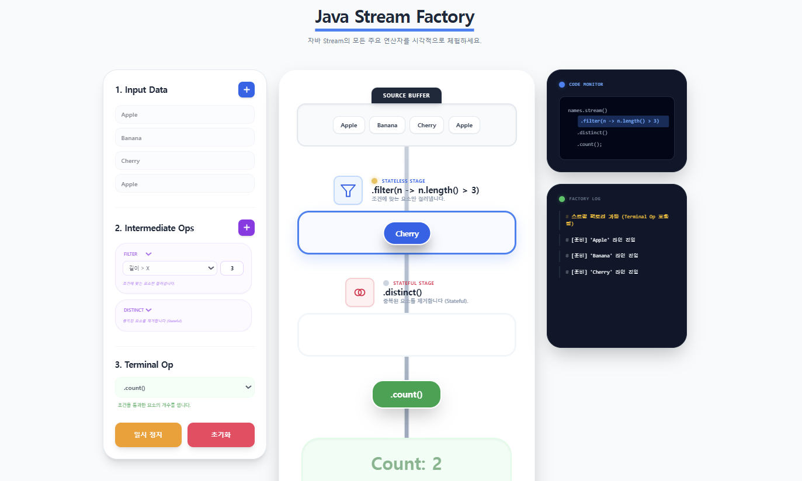
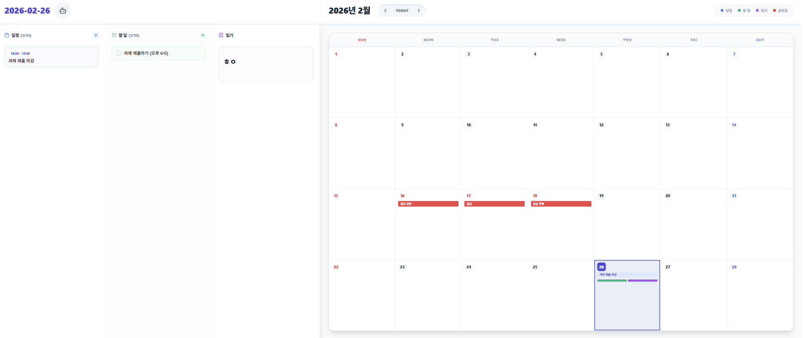

# gemini-canvas-mission

Gemini Canvas 미션 결과물을 관리하는 저장소입니다.

## 목적

- Gemini Canvas로 제작한 웹앱 결과물을 기록하고 공유합니다.
- 앱별 요구사항, 배포 링크, 회고를 일관된 형식으로 남깁니다.

## 앱 설명

### 🛠 1. 유틸리티 앱: 뭐라짓지? (Naming Helper)

**"코드 로직보다 이름 짓기가 더 힘든 개발자를 위한 네이밍 비서"**

🔗 배포 링크: [뭐라짓지?](https://gemini.google.com/share/9155e4611394)

- 제작 동기: 영어가 익숙하지 않아 적절한 변수/함수명을 찾는 데 드는 시간 낭비를 줄이고, 개발 흐름을 유지하기 위해 제작했습니다.

- 주요 기능:
    - 용도별 카테고리, 타겟 언어, 네이밍 스타일 설정
    - 추천 이름과 설명 제공

- 🤖 AI Role: 사용자의 한글 의도를 분석해 카테고리와 스타일에 최적화된 후보군을 추론하여 제시합니다.

### 🎮 2. 게임: 행성 탐사 (Planet Explorer)

**"경쟁의 재미를 더한 10 만들기 퍼즐 게임"**

🔗 배포 링크: [행성 탐사](https://gemini.google.com/share/75930fb7484f)

- 제작 동기: 기존의 단순 퍼즐 게임에 '랭킹 시스템'을 도입하여 경쟁 심리를 자극하고 지속적인 재미를 제공하고자 했습니다.

- 주요 기능:
    - 드래그 액션: 영역 내 행성 숫자 합이 10이 되면 점수 획득
    - 실시간 랭킹: 다른 유저와의 기록 경쟁 시스템

### 📚 3. 학습 앱: 자바 스트림 팩토리 (Java Stream Factory)

**"코드로만 보던 스트림 파이프라인의 시각적 시뮬레이션"**

🔗 배포 링크: [자바 스트림 팩토리](https://gemini.google.com/share/72217d59589d)

- 제작 동기: 자바 스트림의 수직적 실행 구조와 동작 원리를 직관적으로 이해하기 위해 시각화 도구를 만들었습니다.

- 주요 기능:
    - 맞춤형 설정 - Input 데이터, Filter, Map 연산 직접 구성
    - 시각화 애니메이션: 데이터 캡슐이 파이프라인을 통과하며 변하는 과정을 역동적으로 표현

### 🤝 4. 페어 프롬프트 릴레이: 똑똑 플랜 (Smart Plan)

**"자연어 입력 한 줄로 끝내는 스마트 캘린더"**

Collaboration with: @5jonyuk

🔗 배포 링크: [똑똑플랜](https://gemini.google.com/share/aa1d17f05c44)

제작 동기: 직접 입력하는 번거로움 때문에 일정을 놓치는 문제를 해결하기 위해, 메모하듯 툭 던지면 AI가 알아서 정리해주는 플래너를 기획했습니다.

- 주요 기능:
    - 일정/할 일/일기 통합 관리
    - AI 비서가 일정/할 일 정리
    - 캘린더 뷰

🤖 AI Role:

- 자연어 처리: 문장을 분석해 일정·할 일을 자동 생성/수정/삭제합니다.
- 스마트 캘린더: 해당 연도의 공휴일을 AI가 분석해 자동으로 표시하며, 캐싱을 통해 효율적인 데이터 관리를 수행합니다.